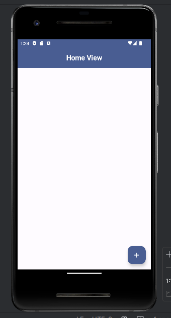
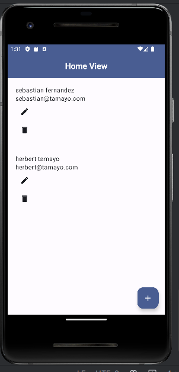

## Proof of Concept ##

### Original tutorial ###

1. Starting point:

2. Adding data:

3. Reading data:

4. Adding one more data:

5. Reading data:

## References ##
[original tutorial](https://www.youtube.com/watch?v=XbV2NwYIeXg&list=PLsQR_Tmsj29nyIzmG0EcCJsvLQC3ze6H0&index=2&t=1348s)
